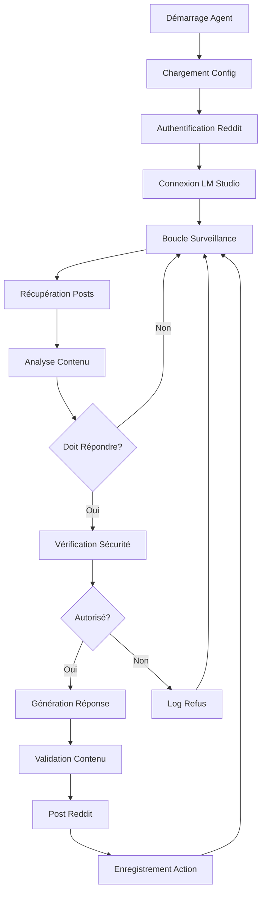
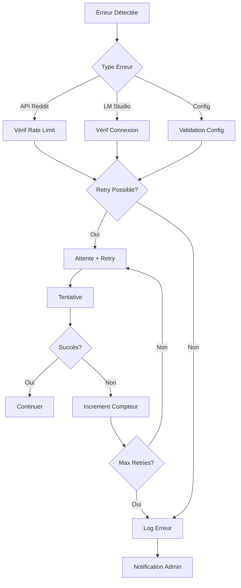

# Documentation Technique - Agent IA Reddit

Cette documentation technique détaille l'architecture, l'implémentation et les aspects techniques avancés de l'Agent IA Reddit.

## Table des matières

1. [Architecture système](#architecture-système)
2. [Composants détaillés](#composants-détaillés)
3. [Flux de données](#flux-de-données)
4. [API et interfaces](#api-et-interfaces)
5. [Sécurité technique](#sécurité-technique)
6. [Performance et optimisation](#performance-et-optimisation)
7. [Extensibilité](#extensibilité)
8. [Tests et validation](#tests-et-validation)

## Architecture système

### Vue d'ensemble

L'Agent IA Reddit suit une architecture modulaire basée sur le pattern Observer avec des composants découplés communiquant via des interfaces bien définies.

```
┌─────────────────────────────────────────────────────────────┐
│                    Agent IA Reddit                         │
├─────────────────────────────────────────────────────────────┤
│  ┌─────────────┐  ┌─────────────┐  ┌─────────────┐        │
│  │ Config      │  │ Reddit      │  │ LM Studio   │        │
│  │ Manager     │  │ Interface   │  │ Interface   │        │
│  └─────────────┘  └─────────────┘  └─────────────┘        │
├─────────────────────────────────────────────────────────────┤
│  ┌─────────────┐  ┌─────────────┐  ┌─────────────┐        │
│  │ Content     │  │ Safety      │  │ Main Agent  │        │
│  │ Analyzer    │  │ Manager     │  │ Controller  │        │
│  └─────────────┘  └─────────────┘  └─────────────┘        │
├─────────────────────────────────────────────────────────────┤
│  ┌─────────────┐  ┌─────────────┐  ┌─────────────┐        │
│  │ Logging     │  │ Data        │  │ Statistics  │        │
│  │ System      │  │ Storage     │  │ Collector   │        │
│  └─────────────┘  └─────────────┘  └─────────────┘        │
└─────────────────────────────────────────────────────────────┘
```

### Patterns architecturaux

#### 1. Dependency Injection

Chaque composant reçoit ses dépendances via le constructeur, facilitant les tests et la maintenance.

```python
class RedditAIAgent:
    def __init__(self, config_path: str):
        self.config_manager = ConfigManager(config_path)
        self.reddit_interface = RedditInterface(self.config_manager.reddit_config)
        self.lm_studio_interface = LMStudioInterface(self.config_manager.lm_studio_config)
        # ...
```

#### 2. Strategy Pattern

L'analyseur de contenu utilise différentes stratégies selon le type de contenu.

```python
class ContentAnalyzer:
    def should_respond_to_post(self, post_data: Dict[str, Any]) -> Dict[str, Any]:
        # Stratégie spécifique aux posts
        
    def should_respond_to_comment(self, comment_data: Dict[str, Any]) -> Dict[str, Any]:
        # Stratégie spécifique aux commentaires
```

#### 3. Observer Pattern

Le système de logging observe tous les événements du système.

```python
# Chaque action génère des événements loggés
self.logger.info(f"Action enregistrée: {action_type}")
self.safety_manager.record_action(action_type, subreddit, target_id, content, success)
```

## Composants détaillés

### ConfigManager

**Responsabilité :** Gestion centralisée de la configuration

**Fonctionnalités clés :**
- Chargement et validation des fichiers YAML
- Parsing en objets typés avec dataclasses
- Validation des credentials
- Gestion des configurations par environnement

**Structure des données :**

```python
@dataclass
class RedditConfig:
    client_id: str
    client_secret: str
    username: str
    password: str
    user_agent: str

@dataclass
class LMStudioConfig:
    base_url: str
    model: str
    api_key: str
    temperature: float
    max_tokens: int
    timeout: int
```

**Validation avancée :**

```python
def _validate_config(self) -> bool:
    # Validation des formats
    if not re.match(r'^[a-zA-Z0-9_-]+$', self.reddit_config.client_id):
        return False
    
    # Validation des URLs
    if not self.lm_studio_config.base_url.startswith(('http://', 'https://')):
        return False
    
    # Validation des plages de valeurs
    if not 0.0 <= self.lm_studio_config.temperature <= 2.0:
        return False
```

### RedditInterface

**Responsabilité :** Interface avec l'API Reddit via PRAW

**Gestion des erreurs Reddit :**

```python
def _handle_reddit_exception(self, e: Exception) -> bool:
    if isinstance(e, praw.exceptions.RedditAPIException):
        for item in e.items:
            if item.error_type == 'RATELIMIT':
                self.logger.warning(f"Rate limit atteint: {item.message}")
                return False
            elif item.error_type == 'THREAD_LOCKED':
                self.logger.info("Thread verrouillé, ignoré")
                return True
    return False
```

**Cache intelligent :**

```python
class RedditInterface:
    def __init__(self, config: RedditConfig):
        self._post_cache = {}
        self._cache_ttl = 300  # 5 minutes
    
    def get_subreddit_posts(self, subreddit_name: str, limit: int = 10):
        cache_key = f"{subreddit_name}:{limit}"
        if cache_key in self._post_cache:
            cached_data, timestamp = self._post_cache[cache_key]
            if time.time() - timestamp < self._cache_ttl:
                return cached_data
        
        # Récupération depuis l'API
        posts = self._fetch_posts(subreddit_name, limit)
        self._post_cache[cache_key] = (posts, time.time())
        return posts
```

### LMStudioInterface

**Responsabilité :** Communication avec LM Studio via API OpenAI compatible

**Gestion des timeouts et retry :**

```python
def generate_response(self, prompt: str, max_retries: int = 3) -> Optional[str]:
    for attempt in range(max_retries):
        try:
            response = self.client.chat.completions.create(
                model=self.config.model,
                messages=[{"role": "user", "content": prompt}],
                timeout=self.config.timeout
            )
            return response.choices[0].message.content
        
        except openai.APITimeoutError:
            if attempt < max_retries - 1:
                wait_time = 2 ** attempt  # Backoff exponentiel
                time.sleep(wait_time)
                continue
            raise
```

**Optimisation des prompts :**

```python
def _optimize_prompt(self, prompt: str, context: Dict[str, Any]) -> str:
    # Compression du contexte si trop long
    if len(prompt) > 2000:
        prompt = self._compress_context(prompt)
    
    # Ajout de métadonnées pour améliorer la génération
    metadata = f"Subreddit: {context.get('subreddit', 'unknown')}\n"
    metadata += f"Type: {context.get('type', 'unknown')}\n"
    
    return metadata + prompt
```

### ContentAnalyzer

**Responsabilité :** Analyse intelligente du contenu pour décider des actions

**Algorithme de scoring :**

```python
def _calculate_relevance_score(self, content_data: Dict[str, Any]) -> float:
    score = 0.0
    
    # Score basé sur les mots-clés (30%)
    keyword_score = self._analyze_keywords(content_data)
    score += keyword_score * 0.3
    
    # Score basé sur les patterns (25%)
    pattern_score = self._analyze_patterns(content_data)
    score += pattern_score * 0.25
    
    # Score basé sur l'engagement (25%)
    engagement_score = self._analyze_engagement(content_data)
    score += engagement_score * 0.25
    
    # Score basé sur la fraîcheur (20%)
    freshness_score = self._analyze_freshness(content_data)
    score += freshness_score * 0.2
    
    return min(score, 1.0)
```

**Machine Learning intégré (optionnel) :**

```python
class MLContentAnalyzer(ContentAnalyzer):
    def __init__(self, model_path: str = None):
        super().__init__()
        if model_path and os.path.exists(model_path):
            self.ml_model = joblib.load(model_path)
        else:
            self.ml_model = None
    
    def _ml_predict_relevance(self, features: np.array) -> float:
        if self.ml_model:
            return self.ml_model.predict_proba([features])[0][1]
        return 0.5  # Score neutre si pas de modèle
```

### SafetyManager

**Responsabilité :** Sécurité, rate limiting et conformité

**Algorithme de rate limiting adaptatif :**

```python
class AdaptiveRateLimiter:
    def __init__(self, base_limits: Dict[str, int]):
        self.base_limits = base_limits
        self.current_limits = base_limits.copy()
        self.error_count = 0
        self.success_count = 0
    
    def adjust_limits(self):
        error_rate = self.error_count / (self.error_count + self.success_count)
        
        if error_rate > 0.1:  # Plus de 10% d'erreurs
            # Réduire les limites
            for key in self.current_limits:
                self.current_limits[key] = max(1, int(self.current_limits[key] * 0.8))
        elif error_rate < 0.05:  # Moins de 5% d'erreurs
            # Augmenter progressivement
            for key in self.current_limits:
                self.current_limits[key] = min(
                    self.base_limits[key],
                    int(self.current_limits[key] * 1.1)
                )
```

**Détection d'anomalies :**

```python
def detect_anomalies(self) -> List[str]:
    anomalies = []
    
    # Détection de pics d'activité
    recent_actions = self._get_recent_actions(3600)  # Dernière heure
    if len(recent_actions) > self.safety_config.max_actions_per_hour * 2:
        anomalies.append("Pic d'activité détecté")
    
    # Détection de patterns suspects
    if self._detect_repetitive_content():
        anomalies.append("Contenu répétitif détecté")
    
    # Détection d'erreurs en cascade
    if self._detect_error_cascade():
        anomalies.append("Cascade d'erreurs détectée")
    
    return anomalies
```

## Flux de données

### Cycle principal de traitement



### Traitement des erreurs



## API et interfaces

### Interface REST (optionnelle)

Pour le monitoring et le contrôle à distance :

```python
from flask import Flask, jsonify, request

app = Flask(__name__)

@app.route('/api/status', methods=['GET'])
def get_status():
    return jsonify(agent.get_status())

@app.route('/api/config', methods=['GET'])
def get_config():
    return jsonify(agent.config_manager.get_public_config())

@app.route('/api/emergency_stop', methods=['POST'])
def emergency_stop():
    reason = request.json.get('reason', 'Manual stop')
    agent.safety_manager.emergency_stop(reason)
    return jsonify({'status': 'stopped', 'reason': reason})

@app.route('/api/statistics', methods=['GET'])
def get_statistics():
    return jsonify(agent.safety_manager.get_statistics())
```

### Interface CLI

```python
import click

@click.group()
def cli():
    """Agent IA Reddit - Interface en ligne de commande"""
    pass

@cli.command()
@click.option('--config', default='config/config.yaml', help='Fichier de configuration')
@click.option('--dry-run', is_flag=True, help='Mode test sans actions réelles')
def start(config, dry_run):
    """Démarre l'agent"""
    agent = RedditAIAgent(config)
    if dry_run:
        agent.config_manager.config['mode']['dry_run'] = True
    agent.start()

@cli.command()
@click.option('--config', default='config/config.yaml')
def test(config):
    """Teste la configuration"""
    # Logique de test
    pass

@cli.command()
@click.option('--days', default=7, help='Nombre de jours de statistiques')
def stats(days):
    """Affiche les statistiques"""
    # Logique d'affichage des stats
    pass
```

## Sécurité technique

### Chiffrement des credentials

```python
from cryptography.fernet import Fernet
import base64

class SecureConfigManager(ConfigManager):
    def __init__(self, config_path: str, key_path: str = None):
        self.cipher = self._load_or_create_key(key_path)
        super().__init__(config_path)
    
    def _load_or_create_key(self, key_path: str) -> Fernet:
        if key_path and os.path.exists(key_path):
            with open(key_path, 'rb') as f:
                key = f.read()
        else:
            key = Fernet.generate_key()
            if key_path:
                with open(key_path, 'wb') as f:
                    f.write(key)
        return Fernet(key)
    
    def _decrypt_sensitive_data(self, encrypted_data: str) -> str:
        return self.cipher.decrypt(encrypted_data.encode()).decode()
```

### Validation des entrées

```python
import re
from typing import Any

class InputValidator:
    @staticmethod
    def validate_subreddit_name(name: str) -> bool:
        # Validation du format des noms de subreddit
        pattern = r'^[a-zA-Z0-9_]{1,21}$'
        return bool(re.match(pattern, name))
    
    @staticmethod
    def validate_content_length(content: str, max_length: int = 10000) -> bool:
        return len(content) <= max_length
    
    @staticmethod
    def sanitize_user_input(input_str: str) -> str:
        # Suppression des caractères dangereux
        sanitized = re.sub(r'[<>"\']', '', input_str)
        return sanitized.strip()
```

### Audit et logging sécurisé

```python
import hashlib
import json
from datetime import datetime

class SecurityAuditor:
    def __init__(self, audit_file: str):
        self.audit_file = audit_file
    
    def log_security_event(self, event_type: str, details: Dict[str, Any]):
        event = {
            'timestamp': datetime.utcnow().isoformat(),
            'event_type': event_type,
            'details': details,
            'hash': self._calculate_hash(details)
        }
        
        with open(self.audit_file, 'a') as f:
            f.write(json.dumps(event) + '\n')
    
    def _calculate_hash(self, data: Dict[str, Any]) -> str:
        content = json.dumps(data, sort_keys=True)
        return hashlib.sha256(content.encode()).hexdigest()
```

## Performance et optimisation

### Profiling et métriques

```python
import time
import functools
from typing import Callable

def performance_monitor(func: Callable) -> Callable:
    @functools.wraps(func)
    def wrapper(*args, **kwargs):
        start_time = time.time()
        result = func(*args, **kwargs)
        end_time = time.time()
        
        execution_time = end_time - start_time
        logger.debug(f"{func.__name__} executed in {execution_time:.3f}s")
        
        # Enregistrer les métriques
        metrics_collector.record_execution_time(func.__name__, execution_time)
        
        return result
    return wrapper

class MetricsCollector:
    def __init__(self):
        self.metrics = {}
    
    def record_execution_time(self, function_name: str, execution_time: float):
        if function_name not in self.metrics:
            self.metrics[function_name] = []
        self.metrics[function_name].append(execution_time)
    
    def get_average_execution_time(self, function_name: str) -> float:
        times = self.metrics.get(function_name, [])
        return sum(times) / len(times) if times else 0.0
```

### Cache multi-niveaux

```python
from functools import lru_cache
import redis

class MultiLevelCache:
    def __init__(self, redis_url: str = None):
        self.memory_cache = {}
        self.redis_client = redis.from_url(redis_url) if redis_url else None
    
    def get(self, key: str) -> Any:
        # Niveau 1: Cache mémoire
        if key in self.memory_cache:
            return self.memory_cache[key]
        
        # Niveau 2: Cache Redis
        if self.redis_client:
            value = self.redis_client.get(key)
            if value:
                deserialized = json.loads(value)
                self.memory_cache[key] = deserialized
                return deserialized
        
        return None
    
    def set(self, key: str, value: Any, ttl: int = 300):
        # Stocker dans les deux niveaux
        self.memory_cache[key] = value
        
        if self.redis_client:
            serialized = json.dumps(value)
            self.redis_client.setex(key, ttl, serialized)
```

### Optimisation des requêtes

```python
class OptimizedRedditInterface(RedditInterface):
    def __init__(self, config: RedditConfig):
        super().__init__(config)
        self.batch_size = 50
        self.request_queue = []
    
    def batch_get_posts(self, subreddit_requests: List[Tuple[str, int]]) -> Dict[str, List]:
        """Récupération en lot pour optimiser les requêtes"""
        results = {}
        
        for subreddit, limit in subreddit_requests:
            # Grouper les requêtes similaires
            if limit <= self.batch_size:
                posts = self.get_subreddit_posts(subreddit, limit)
                results[subreddit] = posts
            else:
                # Diviser les grandes requêtes
                all_posts = []
                for offset in range(0, limit, self.batch_size):
                    batch_limit = min(self.batch_size, limit - offset)
                    batch_posts = self.get_subreddit_posts(subreddit, batch_limit)
                    all_posts.extend(batch_posts)
                results[subreddit] = all_posts
        
        return results
```

## Extensibilité

### Plugin System

```python
from abc import ABC, abstractmethod

class AgentPlugin(ABC):
    @abstractmethod
    def initialize(self, agent: 'RedditAIAgent') -> bool:
        """Initialise le plugin"""
        pass
    
    @abstractmethod
    def process_content(self, content_data: Dict[str, Any]) -> Dict[str, Any]:
        """Traite le contenu"""
        pass
    
    @abstractmethod
    def cleanup(self) -> None:
        """Nettoie les ressources du plugin"""
        pass

class SentimentAnalysisPlugin(AgentPlugin):
    def initialize(self, agent: 'RedditAIAgent') -> bool:
        try:
            from textblob import TextBlob
            self.sentiment_analyzer = TextBlob
            return True
        except ImportError:
            return False
    
    def process_content(self, content_data: Dict[str, Any]) -> Dict[str, Any]:
        text = content_data.get('selftext', '') + ' ' + content_data.get('title', '')
        blob = self.sentiment_analyzer(text)
        
        content_data['sentiment'] = {
            'polarity': blob.sentiment.polarity,
            'subjectivity': blob.sentiment.subjectivity
        }
        
        return content_data

class PluginManager:
    def __init__(self):
        self.plugins = []
    
    def register_plugin(self, plugin: AgentPlugin) -> bool:
        if plugin.initialize(self.agent):
            self.plugins.append(plugin)
            return True
        return False
    
    def process_with_plugins(self, content_data: Dict[str, Any]) -> Dict[str, Any]:
        for plugin in self.plugins:
            content_data = plugin.process_content(content_data)
        return content_data
```

### Configuration dynamique

```python
class DynamicConfigManager(ConfigManager):
    def __init__(self, config_path: str):
        super().__init__(config_path)
        self.config_watchers = []
        self.last_modified = os.path.getmtime(config_path)
    
    def watch_config_changes(self):
        """Surveille les changements de configuration"""
        current_modified = os.path.getmtime(self.config_path)
        if current_modified > self.last_modified:
            self.logger.info("Configuration modifiée, rechargement...")
            self.reload_config()
            self.last_modified = current_modified
    
    def reload_config(self):
        """Recharge la configuration sans redémarrer l'agent"""
        old_config = self.config.copy()
        
        if self.load_config():
            # Notifier les composants du changement
            for watcher in self.config_watchers:
                watcher.on_config_changed(old_config, self.config)
```

## Tests et validation

### Tests unitaires

```python
import unittest
from unittest.mock import Mock, patch

class TestContentAnalyzer(unittest.TestCase):
    def setUp(self):
        self.safety_config = Mock()
        self.triggers = {
            'keywords': ['help', 'question'],
            'patterns': ['.*\\?$']
        }
        self.analyzer = ContentAnalyzer(self.safety_config, self.triggers)
    
    def test_should_respond_to_help_post(self):
        post_data = {
            'id': 'test123',
            'title': 'I need help with Python',
            'selftext': 'Can someone help me?',
            'score': 5,
            'created_utc': time.time() - 3600,
            'author': 'testuser'
        }
        
        result = self.analyzer.should_respond_to_post(post_data)
        self.assertTrue(result['should_respond'])
        self.assertGreater(result['confidence'], 0.5)
    
    def test_should_ignore_low_score_post(self):
        post_data = {
            'id': 'test123',
            'title': 'Help me please',
            'selftext': 'I need assistance',
            'score': -10,  # Score très bas
            'created_utc': time.time() - 3600,
            'author': 'testuser'
        }
        
        result = self.analyzer.should_respond_to_post(post_data)
        self.assertFalse(result['should_respond'])
```

### Tests d'intégration

```python
class TestRedditIntegration(unittest.TestCase):
    def setUp(self):
        self.config = ConfigManager('test_config.yaml')
        self.reddit_interface = RedditInterface(self.config.reddit_config)
    
    @patch('praw.Reddit')
    def test_authentication(self, mock_reddit):
        mock_reddit.return_value.user.me.return_value.name = 'testuser'
        
        result = self.reddit_interface.authenticate()
        self.assertTrue(result)
    
    def test_get_posts_with_rate_limiting(self):
        # Test que les requêtes respectent le rate limiting
        start_time = time.time()
        
        posts1 = self.reddit_interface.get_subreddit_posts('test', 5)
        posts2 = self.reddit_interface.get_subreddit_posts('test', 5)
        
        end_time = time.time()
        
        # Vérifier qu'au moins 2 secondes se sont écoulées
        self.assertGreaterEqual(end_time - start_time, 2.0)
```

### Tests de charge

```python
import concurrent.futures
import threading

class LoadTester:
    def __init__(self, agent: RedditAIAgent):
        self.agent = agent
        self.results = []
        self.lock = threading.Lock()
    
    def simulate_concurrent_requests(self, num_threads: int = 10, requests_per_thread: int = 5):
        with concurrent.futures.ThreadPoolExecutor(max_workers=num_threads) as executor:
            futures = []
            
            for _ in range(num_threads):
                future = executor.submit(self._worker_thread, requests_per_thread)
                futures.append(future)
            
            # Attendre la completion
            concurrent.futures.wait(futures)
    
    def _worker_thread(self, num_requests: int):
        for i in range(num_requests):
            start_time = time.time()
            
            # Simuler une requête
            try:
                posts = self.agent.reddit_interface.get_subreddit_posts('test', 1)
                success = True
            except Exception as e:
                success = False
            
            end_time = time.time()
            
            with self.lock:
                self.results.append({
                    'success': success,
                    'response_time': end_time - start_time,
                    'timestamp': start_time
                })
```

---

Cette documentation technique fournit une base solide pour comprendre, maintenir et étendre l'Agent IA Reddit. Elle couvre les aspects architecturaux, les détails d'implémentation et les considérations de performance nécessaires pour un déploiement professionnel.

